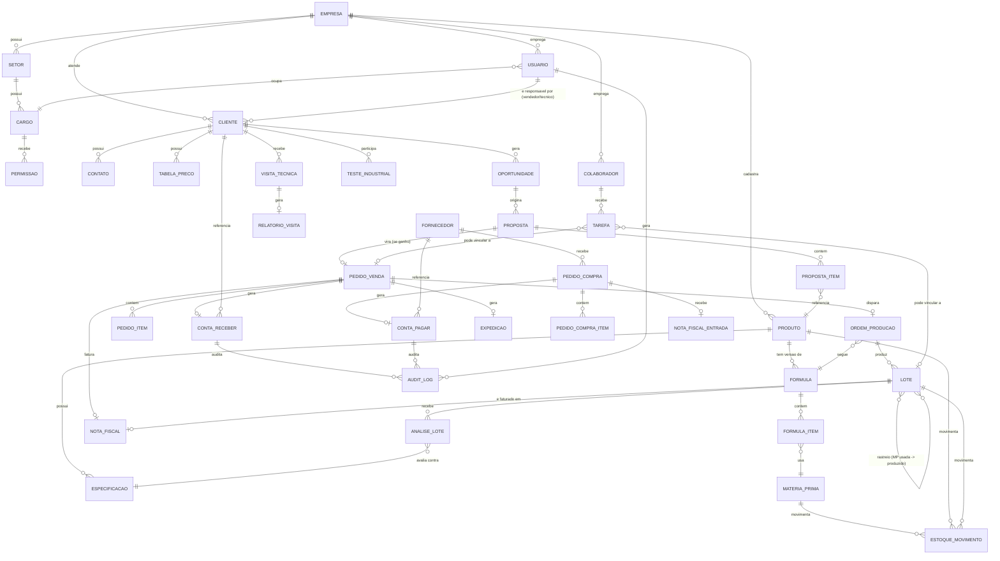

# PLANO — BIOGREEN SYSTEM

> Gerado a partir de `PROMPT-BIOGREEN-SYSTEM.md`, com leitura prévia do projeto **IMETAL** (padrão de arquitetura GB Company) e do site institucional [biogreenquimica.com.br](https://www.biogreenquimica.com.br/) para identidade visual e dados corporativos.

## 1. Resumo executivo

BIOGREEN SYSTEM é o "segundo cérebro" da Biogreen Indústria Química: um sistema único que substitui Conta Azul, MAXCONT e as planilhas de Excel, interligando comercial, assistência técnica, produção, qualidade, estoque, compras, fiscal, financeiro, logística, pessoas e uma camada de IA conversacional sobre os dados da empresa.

Este documento cobre o passo 1 pedido no prompt original: arquitetura escolhida, diagrama de entidades, módulos por fase e perguntas abertas. **Nenhum código será escrito até a aprovação deste plano.**

## 2. Arquitetura escolhida

A pasta `IMETAL` (outro projeto GB Company, mesmo cliente-tipo de sistema interno) está acessível neste ambiente — conforme instruído no prompt original, a arquitetura abaixo **reaproveita as decisões já validadas lá** em vez da proposta de monorepo/NestJS/BullMQ da seção 3 do prompt, para manter padronização entre os projetos da GB Company.

| Camada | Decisão | Por quê |
|---|---|---|
| App | **Next.js (App Router) monolítico** — front-end e API routes no mesmo app, sem monorepo `apps/web` + `apps/api` | É o padrão do Imetal; evita overhead de monorepo/packages para um time pequeno, e Next API routes cobrem tanto REST quanto server actions |
| Linguagem | TypeScript em todo o projeto | Padrão Imetal |
| Banco | **PostgreSQL + Prisma**, hospedado no **Neon via integração nativa Vercel** (`DATABASE_URL` pooled + `DATABASE_URL_UNPOOLED` para migrations) | Padrão Imetal, já validado em produção |
| Auth | **Auth própria** — sessão em cookie httpOnly assinado com JWT (`jose`), sem serviço externo — **estendida** com RBAC granular por setor/cargo/ação (ver/criar/editar/aprovar/excluir), já que o BIOGREEN precisa de permissões mais finas que o Imetal (que hoje só tem `canEdit` + colunas visíveis) | Reaproveita o mecanismo testado, adiciona o que falta |
| Storage | **Vercel Blob** (mesmo padrão do Imetal), com fallback automático para disco local em dev quando não há token — igual `lib/storage.ts` do Imetal | Simplicidade operacional; ⚠️ ver pergunta aberta P13 sobre volume esperado (FISPQ, COA, DANFE, fotos) |
| UI | Tailwind CSS + **shadcn/ui** + lucide-react + Recharts (Recharts já é o padrão Imetal) | Consistência visual entre projetos GB Company |
| Validação | Zod | Padrão do prompt original, compatível com Imetal |
| Jobs/filas | **Sem Redis dedicado** — proposta: Vercel Cron + tabela `job` própria para tarefas assíncronas leves (envio de e-mail, geração de PDF), evoluindo para **Inngest** (serverless, sem infra própria) se o volume justificar | BullMQ exige Redis gerenciado, que não existe no ambiente Vercel do Imetal; ver pergunta aberta P12 |
| IA | API Anthropic (Claude) chamada só em route handlers/server actions — chave nunca exposta ao cliente | Igual ao prompt original |
| Deploy | **Vercel** (produção) + Postgres Neon gerenciado | Igual ao Imetal, troca o "Docker Compose/VPS" da seção 3 |
| Auditoria | Tabela `audit_log` + campos `created_by/updated_by/created_at/updated_at/deleted_at` em toda entidade operacional | Mantido conforme prompt original (Imetal não tinha essa necessidade) |
| i18n | `next-intl` preparado desde a Fase 0, pt-BR como padrão | Site da Biogreen já é PT/EN/FR/ES |
| PWA | Manifest + service worker (`next-pwa` ou equivalente) nas telas de produção/expedição/visita técnica | Uso em tablet, conforme prompt original |

**Identidade visual confirmada no site:** logo com folha estilizada em tons de verde + wordmark "BIOGREEN Chemicals" (salvo em [`docs/assets/logo-biogreen.jpg`](assets/logo-biogreen.jpg)), tagline *"Um Parceiro Local Internacional, Independente E Competente A Sua Disposição"*. O site não expõe hex codes em CSS acessível publicamente — a paleta final (verde institucional + neutros + cor de acento) será extraída por amostragem do logo na Fase 0 e ajustada em conversa com o cliente.

## 3. Diagrama de entidades (visão conceitual)

Diagrama de alto nível — cobre as entidades centrais de cada módulo e como elas se conectam. O detalhamento completo (campos, tipos, constraints) nasce direto em `prisma/schema.prisma` na Fase 0, não neste documento.

## 4. Módulos por fase

Segue a ordem de prioridade do prompt original (seção 7), com o banco modelado por completo desde a Fase 0.

### Fase 0 — Fundação
- App Next.js configurado (mirror Imetal: Tailwind, Prisma, auth JWT, Vercel Blob).
- Schema Prisma completo com **todas** as entidades do diagrama acima (mesmo que a fase só implemente UI para uma parte).
- Auth + RBAC granular (setor/cargo/ação), soft delete e `audit_log` em toda tabela operacional.
- Design system: paleta verde derivada do logo, modo claro/escuro, sidebar recolhível por módulo, busca global (⌘K).
- Painel da Empresa com dados de seed fictícios realistas da Biogreen.
- `docker-compose` **apenas para Postgres local de dev** (Vercel Blob/Neon continuam sendo os serviços de produção).
- Deploy inicial na Vercel funcionando.

### Fase 1 — Comercial + Cadastros + Assistência Técnica
- Cadastros mestres completos (clientes, fornecedores, transportadoras, produtos, matérias-primas, embalagens, unidades de medida com conversão).
- Funil de oportunidades (kanban), propostas com PDF, pedidos de venda, contratos recorrentes, tabela de preços, comissões, metas e dashboard comercial.
- Agenda de visitas técnicas (PWA, check-in com foto/geo), relatório de visita em PDF, testes industriais, base de conhecimento técnica.

### Fase 2 — Financeiro + Fiscal + migração
- Contas a receber/pagar, plano de contas, conciliação OFX, boletos/PIX (adapter), fluxo de caixa, DRE gerencial, curva ABC, alçadas de aprovação.
- NF-e/NFS-e via adapter de provedor, cálculo de impostos parametrizável, portal do contador.
- Importadores CSV/Excel do Conta Azul e MAXCONT.

### Fase 3 — Estoque + Compras + Produção + Qualidade
- Estoque por local/lote com FIFO/FEFO, código de barras/QR, inventário cíclico, estoque mínimo e sugestão de compra.
- Compras: requisição → cotação → pedido → recebimento → conferência → contas a pagar; importação/exportação internacional.
- Fórmulas/BOM versionadas, ordens de produção com apontamento real vs. teórico, custo real por lote, agenda de reatores, manutenção preventiva.
- Especificações, análises por lote, COA em PDF, inspeção de recebimento, não conformidades (8D), controle de FISPQ.

### Fase 4 — Expedição + Pessoas + Prestação de Contas + Cérebro IA + WhatsApp
- Separação, conferência QR, romaneio, etiquetas de risco/ONU, rastreio, comprovante de entrega.
- Colaboradores, EPIs, treinamentos com validade, tarefas/kanban vinculável a qualquer registro.
- Fechamento mensal, relatório de prestação de contas (PDF + tela executiva), KPIs com semáforo.
- Cérebro IA: chat com permissão do usuário, resumo diário, sugestões proativas, confirmação humana obrigatória para ações que alteram dados.
- WhatsApp Business API (notificações + régua de cobrança).

## 5. Perguntas abertas

Estas ficam também registradas em [`docs/PERGUNTAS.md`](PERGUNTAS.md), que será atualizado a cada nova decisão ambígua encontrada durante o desenvolvimento (conforme instrução do prompt original). Até serem respondidas, cada item segue com um valor padrão configurável.

**Sobre a arquitetura (decisões técnicas que valem confirmar antes da Fase 0):**
1. Confirma o desvio do monorepo/NestJS da seção 3 do prompt em favor de reaproveitar a arquitetura do Imetal (Next.js monolítico)?
2. Aceita Vercel Cron + tabela de jobs (evoluindo para Inngest se necessário) no lugar de BullMQ + Redis?
3. Mantém Vercel Blob como storage mesmo com o volume maior esperado (FISPQ, COA, DANFE, fotos de expedição/visita), ou prefere já nascer com S3 dedicado?

**Sobre o negócio (precisam ser levadas à Biogreen):**
4. Regime tributário da empresa e como calcular impostos por padrão nas operações internas vs. interestaduais.
5. Provedor de NF-e/NFS-e a contratar (Focus NFe, NFe.io, outro) e se já existe certificado digital A1/A3 disponível.
6. Regras de comissão: percentual por produto/segmento/vendedor, cálculo sobre faturado ou recebido, existência de teto ou escalonamento.
7. Alçadas de aprovação: valores-limite para propostas, pedidos de compra e pagamentos, e quem são os aprovadores em cada nível.
8. Margem mínima por produto/segmento que bloqueia ou exige aprovação numa proposta.
9. Gateway bancário/PIX preferido para cobrança (Asaas, Inter, Cora, outro) e se já há conta ativa.
10. Formato exato disponível para exportação do Conta Azul e do MAXCONT (quais campos, quanto de histórico migrar).
11. Quais produtos da linha atual são "controlados" (Polícia Federal/Exército) e prazos de renovação das licenças vigentes.
12. WhatsApp Business API: a Biogreen já tem conta/BSP contratado, ou a GB Company deve indicar um provedor?
13. Estrutura: Biogreen opera hoje como unidade única, ou já existem filiais/CDs que exigem suporte multi-unidade desde a Fase 0?

## 6. Próximos passos

Aguardando OK para iniciar a **Fase 0 — Fundação**. Itens 1–3 (arquitetura) idealmente confirmados antes de começar a codar; itens 4–13 (negócio) podem ser levados à Biogreen em paralelo ao desenvolvimento, já que cada um nasce com um valor padrão configurável em vez de travar o trabalho.
